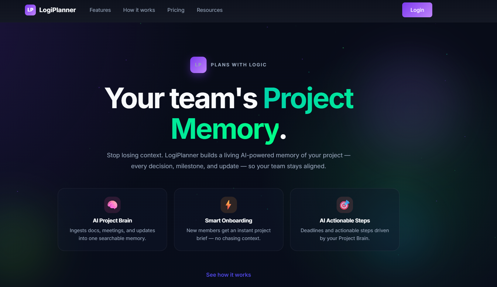
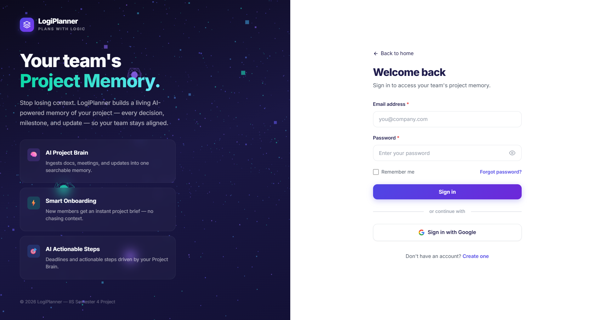
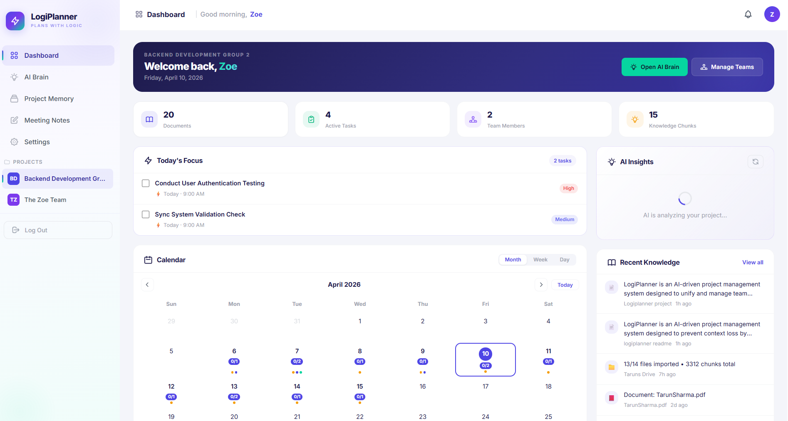
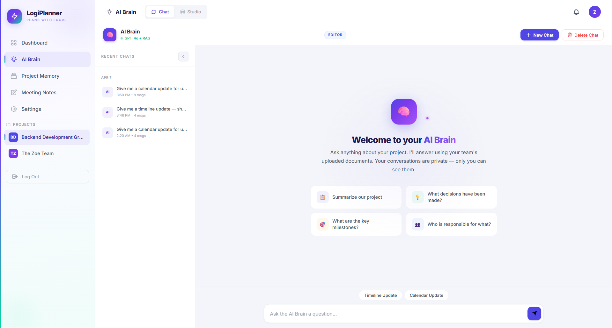

# LogiPlanner — Plans With Logic 🧠

[](https://fastapi.tiangolo.com)
[](https://www.postgresql.org)
[](https://www.python.org)






**LogiPlanner** is an AI-driven project management and **project memory** system. It unifies scattered information — from Miro boards and Slack chats to meeting notes and Drive files — into a single intelligent, searchable, and evolving **"Project Brain."**

---

## 🚀 The Vision

Modern teams suffer from **context loss**. Decisions are forgotten, updates are fragmented, and onboarding is a bottleneck. LogiPlanner solves this with:
- **Intelligent Context:** A RAG-powered brain that remembers everything.
- **Human Verification:** Humans review AI insights before they enter the "Project Memory," ensuring zero hallucinations.
- **Seamless Ingestion:** Automatic sync with your existing tools (GitHub, Drive, Miro).


---

## 📁 Project Structure

```text
logiplanner/
├── app/                  # FastAPI Application
│   ├── core/             # Config, Security, Database
│   ├── api/v1/           # API Endpoints (Auth, OAuth, Teams)
│   ├── models/           # SQLAlchemy Models
│   ├── schemas/          # Pydantic Models
│   ├── templates/        # Jinja2 HTML Pages
│   └── static/           # Vanilla CSS & JavaScript
├── migrations/           # Alembic Versioning
├── CODEBASE_CONTEXT.md   # [CRITICAL] Full Developer Context
└── main.py               # Application Entrypoint
```

---

## ⚡ Quick Start

### 1. Setup Environment
```bash
git clone <repo-url>
cd logiplanner
python -m venv venv
source venv/bin/activate  # venv\Scripts\activate on Windows
pip install -r requirements.txt
```

### 2. Configure Environment & Database
- Ensure **PostgreSQL** is running.
- Create a database: `logiplanner`
- Copy `.env.example` to `.env` and fill in your actual secrets/keys.
- (See `CODEBASE_CONTEXT.md` for variable details.)

### 3. Run Migrations & Start
```bash
# Apply all existing migrations to your database
alembic upgrade head
python main.py
```
Visit `http://127.0.0.1:8000` to get started.

> ⚠️ **Do NOT run `alembic revision --autogenerate` here.** That command creates a *new* migration file and is only needed when you've changed a model. See [Alembic Workflow](#-alembic-migrations-workflow) below.

---

## 📕 Documentation

For a deep-dive into the architecture, database schema, and coding conventions, please refer to:
👉 **[CODEBASE_CONTEXT.md](./CODEBASE_CONTEXT.md)**

This file is the **Ground Truth** for all developers and AI assistants working on this project.

---

## 🌿 Git Workflow

### 1. Start from an up-to-date main
```bash
git checkout main
git pull origin main
```

### 2. Create a new branch
Name branches using the format `feature/`, `fix/`, or `chore/` followed by a short description.
```bash
git checkout -b feature/your-feature-name
```

### 3. Make your changes
Edit files, then stage and commit with a descriptive message.
```bash
git add .
git commit -m "feat: add short description of what you did"
```

### 4. Push your branch
```bash
git push origin feature/your-feature-name
```

### 5. Open a Pull Request
- Go to the repository on GitHub.
- Click **"Compare & pull request"** for your branch.
- Fill in the PR title and description explaining **what** changed and **why**.
- Request a reviewer and submit.

### 6. After approval — merge and clean up
```bash
# Switch back to main and pull the merged changes
git checkout main
git pull origin main

# Apply any new migrations that came in with the merge
alembic upgrade head

# Delete your local branch
git branch -d feature/your-feature-name
```

---

## 🗄️ Alembic Migrations Workflow

### Applying migrations (after a pull or merge)
Whenever you pull from `main` or merge a PR, **just run:**
```bash
alembic upgrade head
```
This applies any new migration files that came in. That's it.

### Creating a new migration (only when YOU changed a model)
If you edited a file in `app/models/`, you need to generate a migration **on your branch**:
```bash
alembic revision --autogenerate -m "short description of what changed"
alembic upgrade head
```
Then commit the new file created in `migrations/versions/`.

### Fixing a "multiple heads" error
If you see `ERROR: Multiple head revisions are present` after merging two branches, you need to create a merge revision:
```bash
alembic heads          # shows the two conflicting revision IDs
alembic merge heads -m "merge migrations"
alembic upgrade head
```
Commit the new merge revision file that Alembic creates.

### Fixing a "DuplicateTable" / blank version error
If you see `relation "X" already exists` when running `alembic upgrade head`, it means the `alembic_version` table got wiped but all DB tables already exist. Check the heads and re-stamp:
```bash
alembic heads                        # copy the head revision ID shown
alembic stamp <revision-id>          # e.g. alembic stamp 9dc80657e12e
alembic upgrade head                 # should now run cleanly (nothing to apply)
```

### Never do this
- ❌ `alembic stamp head` before a `upgrade head` when columns are missing — this marks migrations as done without actually running them (you'll get 500 column errors)
- ❌ Running `alembic revision --autogenerate` after a pull — this creates a duplicate/empty migration for changes that are already tracked

---

**LogiPlanner** — *Plans With Logic*